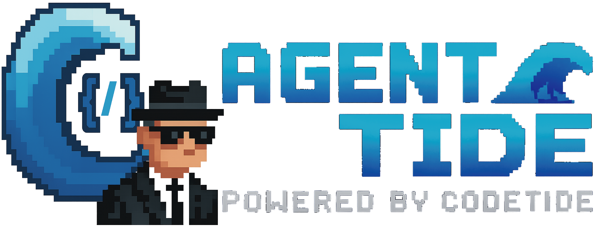

# 

---

# Welcome to Agent Tide! 🚀🤖

```
█████╗  ██████╗ ███████╗███╗   ██╗████████╗    ████████╗██╗██████╗ ███████╗
██╔══██╗██╔════╝ ██╔════╝████╗  ██║╚══██╔══╝    ╚══██╔══╝██║██╔══██╗██╔════╝
███████║██║  ███╗█████╗  ██╔██╗ ██║   ██║          ██║   ██║██║  ██║█████╗  
██╔══██║██║   ██║██╔══╝  ██║╚██╗██║   ██║          ██║   ██║██║  ██║██╔══╝  
██║  ██║╚██████╔╝███████╗██║ ╚████║   ██║          ██║   ██║██████╔╝███████╗
╚═╝  ╚═╝ ╚═════╝ ╚══════╝╚═╝  ╚═══╝   ╚═╝          ╚═╝   ╚═╝╚═════╝ ╚══════╝
```

---

## What is Agent Tide?

**Agent Tide** is a next-generation, precision-driven software engineering agent built on top of [CodeTide](https://github.com/BrunoV21/CodeTide). It enables you to interact directly with your local codebase—**everything is local and stays local**. No code, context, or metadata ever leaves your machine.

Unlike most agent frameworks that rely on hidden inner logic, opaque planning, or LLMs doing everything in a single pass, Agent Tide offers a transparent, stepwise, and human-in-the-loop workflow. Think of it as "ChatGPT, but connected to your codebase"—with full visibility and control over every change.

---

## How Does Agent Tide Work?

1. **Direct Codebase Connection & Context Loading**
   - Agent Tide uses CodeTide's fast, symbolic codebase parser to build a tree of all code identifiers (functions, classes, methods, etc.).
   - When you make a request, Agent Tide analyzes it and loads only the relevant identifiers and their dependencies—retrieving just the code snippets needed for your task.
   - This context loading is fast, deterministic, and fully local.

2. **Three Modes of Operation**
   - **Clarification:** If your request is ambiguous, Agent Tide will ask for more information before proceeding.
   - **Direct Implementation:** For simple, clear requests, Agent Tide will immediately generate a patch to fulfill your request.
   - **Planning Mode:** For complex tasks, Agent Tide enters a planning mode—decomposing your request into a step-by-step plan. You can review, edit, or reorder steps before execution.

3. **Human-in-the-Loop, Stepwise Execution**
   - You always see the plan before any code is changed. You can modify steps, request clarifications, or approve the plan.
   - When ready, click "Proceed to next step" to have Agent Tide implement each step sequentially.
   - After each step, you can review the patch, provide feedback, or continue to the next step—**keeping you in control at all times**.

4. **Patch-Based, Token-Efficient Editing**
   - All code changes are generated as atomic, high-precision diffs (patches), not full file rewrites.
   - This means you see exactly what will change, and can stop or correct the agent at any point—no waiting for a huge batch of changes to finish before intervening.
   - This approach is also highly efficient for LLM token usage and latency.

5. **Privacy & Local-First Philosophy**
   - No code, context, or metadata is sent to any external service other than the selected LLM provider.
   - All code analysis, context building, and patching is performed locally.

6. **Model Compatibility**
   - Agent Tide works best with GPT-4.1, Claude Sonnet 4, and Opus 4.1.
   - Some models (e.g., DeepSeek Chat) may struggle with patch/diff generation.

7. **Terminal & MCP Integration**
   - Terminal access is not available yet.
   - MCP (Multi-Component Patch) integration via aicore is deactivated by default in this demo, but can be enabled for more advanced use cases.

---

## Why Agent Tide?

- **Transparency:** Every step, plan, and patch is visible and editable before execution.
- **Control:** You decide when and how changes are applied—no "black box" agent behavior.
- **Precision:** Code changes are atomic, minimal, and always shown as diffs.
- **Speed:** Context loading and patching are fast, thanks to CodeTide's symbolic engine.
- **Privacy:** Your code never leaves your machine.

---

## Example Things to Ask Agent Tide

You can ask Agent Tide to perform a wide variety of code-related tasks. Here are some example prompts to get you started:

- **Add new functionality**
  - "Add a function to calculate the factorial of a number in `utils.py`."
  - "Implement a REST API endpoint for user registration."

- **Refactor or improve code**
  - "Refactor the `process_data` function to improve readability and performance."
  - "Rename the variable `x` to `user_id` throughout `models/user.py`."

- **Fix bugs**
  - "Fix the bug where the login form crashes on empty input."
  - "Resolve the off-by-one error in the `get_page` method."

- **Write or update tests**
  - "Add unit tests for the `EmailSender` class."
  - "Increase test coverage for `api/views.py`."

- **Documentation**
  - "Generate a docstring for the `parse_config` function."
  - "Update the README with installation instructions."

- **Code analysis and suggestions**
  - "List all functions in `main.py` that are missing type annotations."
  - "Suggest performance improvements for the `data_loader` module."

- **Other codebase tasks**
  - "Delete the deprecated `old_utils.py` file."
  - "Move the `helpers` directory into `core/`."

Feel free to be specific or general in your requests. Agent Tide will analyze your codebase and generate precise, production-ready patches to fulfill your needs!

---

## Usage Tips & Advanced Workflows

- **Direct Context Control:**  
  If you already know the exact code context you want Agent Tide to use, you can specify identifiers directly in your request.  
  Use the format:  
  ```
  module.submodule.file_withoutextension.object
  ```
  For example:  
  ```
  Please update codetide.agents.tide.ui.app.agent_loop to support async.
  ```
  This helps Agent Tide load only the relevant code blocks, making the process faster and more precise.

- **Planning and Human-in-the-Loop:**  
  Agent Tide allows you to interact directly with your local codebase—everything is local and will stay local.  
  Most agent frameworks are filled with hidden logic, letting the LLM do all the planning and execution at once.  
  Agent Tide offers a more direct perspective:  
    - The first thing Agent Tide does is use the CodeTide repo tree to load identifiers related to your request, then builds context blocks with the relevant code snippets (and their dependencies).
    - Once context is loaded, Agent Tide can:
      1. Ask for more information or clarification if your request is ambiguous.
      2. Start implementing changes right away if the request is simple.
      3. Enter planning mode and present you with a step-by-step plan (you can also request this explicitly: "create me a plan to do X").
    - You can edit the plan, reorder steps, or request changes until you are satisfied.
    - Click "Start implementing steps" and Agent Tide will go step by step, letting you review, correct, or continue after each one.
    - This keeps you in the loop and gives you direct control and visualization of every change.
    - Code is generated as diffs for optimized token usage and latency—so you can intervene at any point, even if the agent is working on many files.

- **Model and Integration Notes:**  
  - Agent Tide works best with GPT-4.1, Claude Sonnet 4, and Opus 4.1.  
  - Models like DeepSeek Chat may struggle with patch generation.  
  - Terminal access is available for advanced workflows.  
  - MCP integration (via aicore) is deactivated by default in this demo.

---

## Available Slash Commands

Agent Tide supports special commands that can be invoked directly from the chat input using a `/command` syntax. These commands provide quick access to advanced features and workflows.

### How to Use

Type `/command` (replace `command` with the actual command name) in the text input box and press Enter. Agent Tide will recognize and execute the command.

### Available Commands

1. **/test**
   - **Description:** Request test implmentations for a specific element.
   - **Usage:**  
     `/test` add coverage for apply_patch tool.

2. **/review**
   - **Description:** Request a code review for a specific file, function, or recent patch.
   - **Usage:**  
     `/review` codetide/agents/tide/ui/app.py

3. **/commit**
   - **Description:** Generate a concise, production-ready commit message for the most recent patch or set of changes.
   - **Usage:**  
     `/commit` the changes we just made

You can use these commands at any time to guide Agent Tide's workflow, request reviews, or generate commit messages. More commands may be added in the future—refer to this section for updates.
  
---

**Original repository:** [https://github.com/BrunoV21/CodeTide](https://github.com/BrunoV21/CodeTide)

---

_This README was written by AgentTide!_
